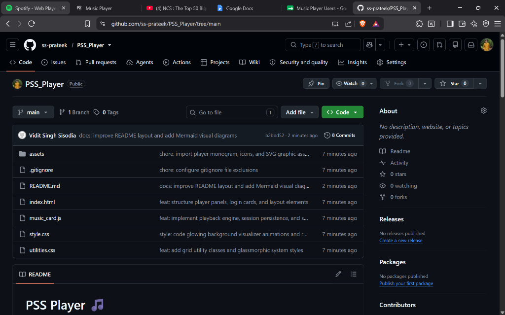
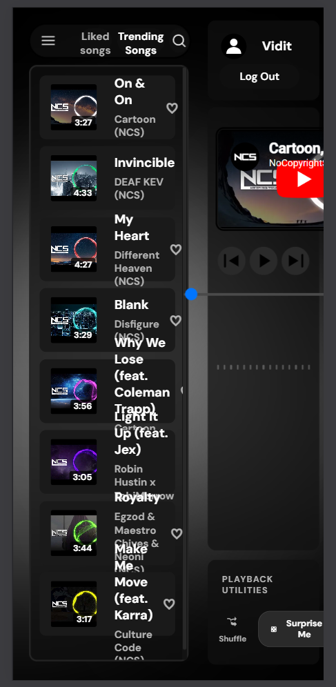
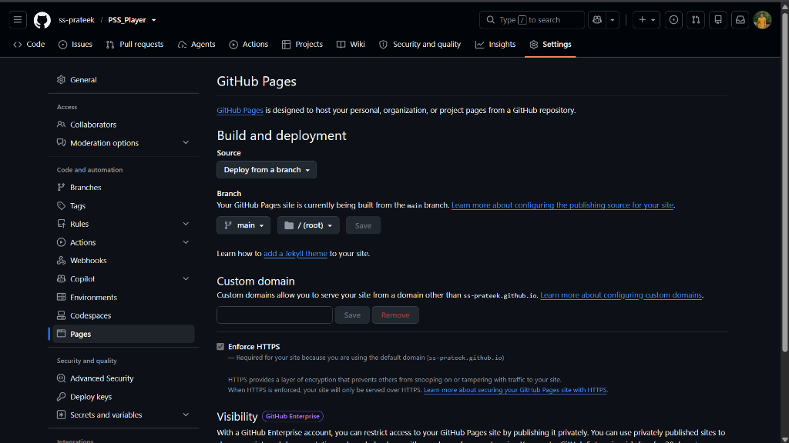
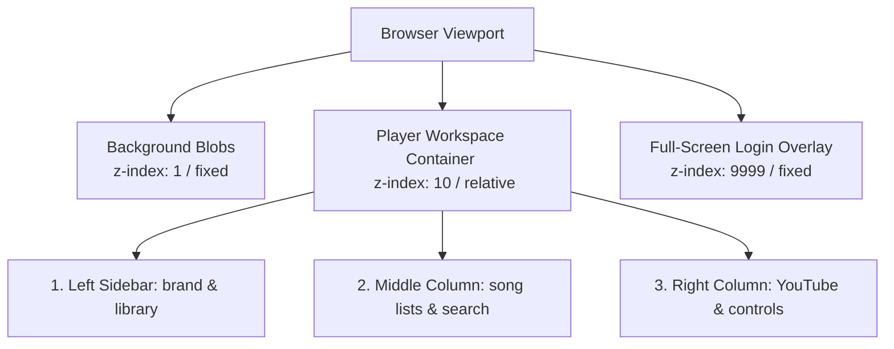
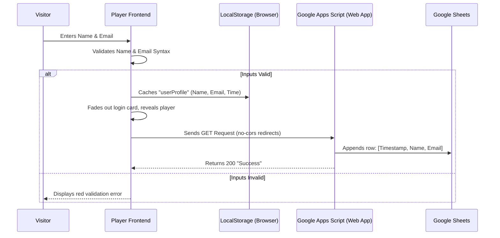
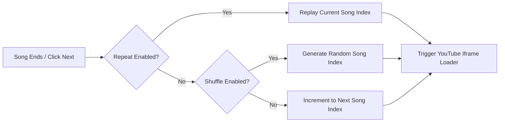

# PSS Player 🎵

PSS Player is a premium, dark-themed music player powered by the **YouTube IFrame API** and styled with modern **liquid glassmorphism design principles**. It features a serverless database backend utilizing **Google Apps Script** to log user logins directly to a Google Sheet.

👉 **[Launch Live Demo](https://ss-prateek.github.io/PSS_Player/)**

---

## 📸 Screen Previews

### 1. Login Gateway (Drifting Ambient Background)

### 2. Main Player Workspace (Frosted Glass Panels & Audio Waves)

### 3. Mobile Responsive Layout (Single-Column App View)

---

## 📊 Architectural Visuals

### 1. Panel Layout & Stacking Layers (Z-Index Grid)
This diagram explains how the elements are layered on top of each other, allowing the animated background fog to glow through the transparent panels.

---

### 2. Login & Serverless Database Pipeline
This sequence diagram shows how your name and email are validated on the client side, cached in browser memory, and posted securely to your Google Sheet without CORS blocks.

---

### 3. Playback Utilities State Flow
This diagram illustrates how the customized playback deck manages linear queue lists, shuffle jumps, and repeat callbacks.

---

## 🌟 Core Features

* **🌌 Liquid Glassmorphic Aesthetic:** Applied to all sidebar cards, headers, and control decks. Uses semi-transparent dark frames (`rgba(15,15,15,0.7)`) and a deep backdrop blur (`backdrop-filter: blur(12px)`) so background elements merge together.
* **✨ Floating Ambient Background:** Three custom blurred circles float slowly across the viewport using staggered CSS keyframes. When they pass behind cards, they create a moving, liquid-glass distortion.
* **🔒 Profile Session Persistence:** Automatically checks if a user is logged in. If yes, it bypasses the login card and loads their custom username in the account panel. If not, it completely hides the player grid to display the login screen.
* **⚡ YouTube Streaming Integration:** Uses the official YouTube IFrame API to stream audio. It hides native YouTube player controls and runs a 500ms Javascript loop to translate active video positions onto a custom seek slider.
* **📊 Bouncing Neon visualizer:** A custom audio equalizer containing 15 vertical white bars that bounce dynamically when music plays and collapse to a flat, dim baseline when paused.
* **📱 Responsive Layout Drawer & Stacks:**
  * **Tablets (under 992px):** Left sidebar slides off-screen (`transform: translateX(-110%)`) and is opened via a header hamburger button. Close button is styled as a circular water droplet.
  * **Mobile Phones (under 650px):** Layout switches from horizontal columns to a single vertical scrollable column. Text wrapping is suppressed to prevent clashing.

---

## 🛠️ Technology Stack & Libraries

* **Markup Structure:** HTML5
* **Styling & Animations:** CSS3 (Atomic utilities, custom scrollbars, keyframe trajectories, and glassmorphism styling)
* **Application Logic:** Vanilla JavaScript ES6
* **Audio Streaming API:** YouTube IFrame Player API
* **Database Endpoint:** Google Apps Script Web App (Redirect-safe GET request pipeline)
* **Credits:** Created by **Vidit Singh Sisodia** (GitHub: [@ss-prateek](https://github.com/ss-prateek))
